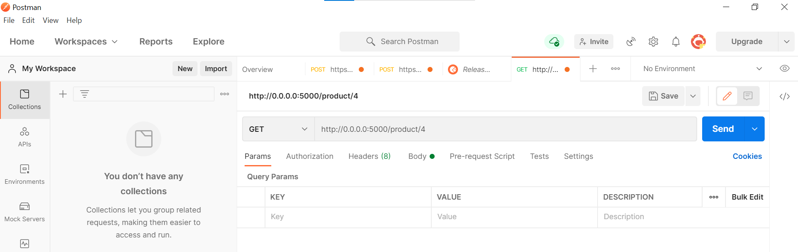
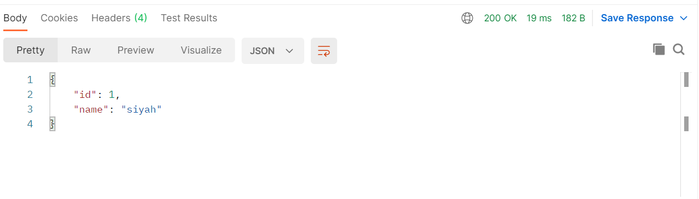
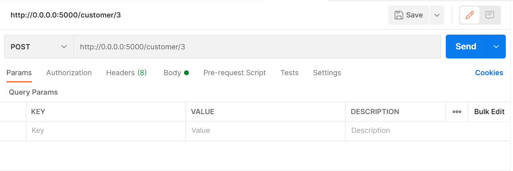
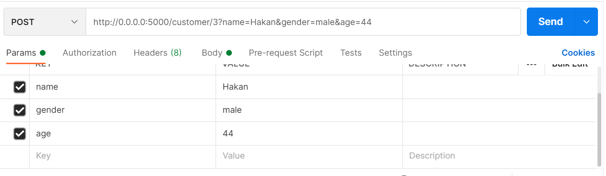
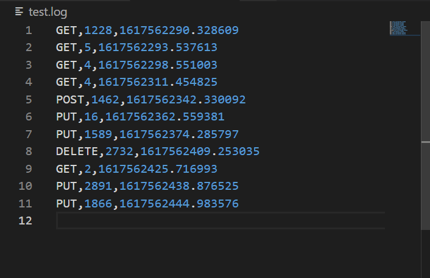

# REST-API
---
## Bu çalışmada Flask kullanarak yapılmış bir RESTAPI sunulmuştur. Bu API'ye Postman kullanarak istek gönderelim. Bunun için ilk etapta aşağıdaki linkten postman kurulumu yapmalıyız.

[Postman Kurulum Linki](https://www.postman.com/downloads/)

## Postman kurulumunu yaptıktan sonra, repoyu klonlayabilirsiniz. Klonlanan repoya Powershell ya da terminalinizden ulaşarak

```bash
docker-compose up
```
## komutunu çalıştırmalıyız. Eğer app düzgün şekilde çalışıyorsa çıkan localhost:port değerlerini kullanarak RESTAPI'mize requestler gönderelim.

---
### Projemizde request gönderebileceğimiz 4 farklı endpoint bulunmaktadır.

* /product/<product_id>
* /customer/<customer_id>
* /brand/<brand_id>
* /color/<color_id>

## Şimdi postman kullanrak nasıl request atabileceğimizi görelim.



### İstenilen 4 endpointten birini yazdıktan sonra id numarasını /'lerle girip "send" butonuna basmamız yeterli olacaktır. Eğer database'imizde aynı id'ye kayıtlı bir kayıt varsa bunu aşağıdaki gibi postmanın body kısmında görürüz. Ayrıca RESTAPI'de belirttiğimiz HTTP statü kodlarını da sağ üst köşede görebiliriz.



## GET ve DELETE metodlarına atılan requestler tamamen aynı formatta olmakla birlikte POST ve PUT metodlarında farklılık vardır.

* POST ve PUT metodları için örnek request aşağıdaki gibi olmalıdır. Her iki metod da boş body request ile çalışabildikleri için direkt id olarak gönderilen POST request için içeriği null olan datalar üretilir. Aynı durumda PUT için girilen id'ye ait kayıttta herhangi bir değişiklik olmaz.
    
    * 
* Şimdi ise sırasıyla istenilen değerleri girilen POST ve PUT request örneklerine bakalım.
    * 
    * 
---
### Bu isteklerden de görüleceği gibi id'den sonra '?' konulup, girilen her blok özellik için araya '&' işareti konulmalıdır.

### Projede dönülen HTTP statü kodları ve anlamları:

* 200 - *OK*
* 201 - *Created*
* 204 - *No Content*
* 404 - *Not Found*
* 409 - *Conflict*

### API'ye atılan tüm istekler metod tipi, response süresi ve timestamp bilgileriyle birlikte log dosyası içine yazdılır.



---
---
## Bana verilen görev içeriğindeki anahtar kod: gAAAAABgUIR7JP-Ap9yr3_buSRDFTeYefkB9keB1p-A8PAG7cAirysDytcS5SuPBy4ERkqyHgLgPyCmYPTSNRCZhEgFpb_KHLzmUAI7zCb5IzzsDSjvE8ZuNJGM2veJO92nKACorn1Coz_TM4rDsQB4vl9X0QePVccnIKj7Hxg9rptbxGX3izNW-GyZTQhTdEwyKh0i0cs1H

